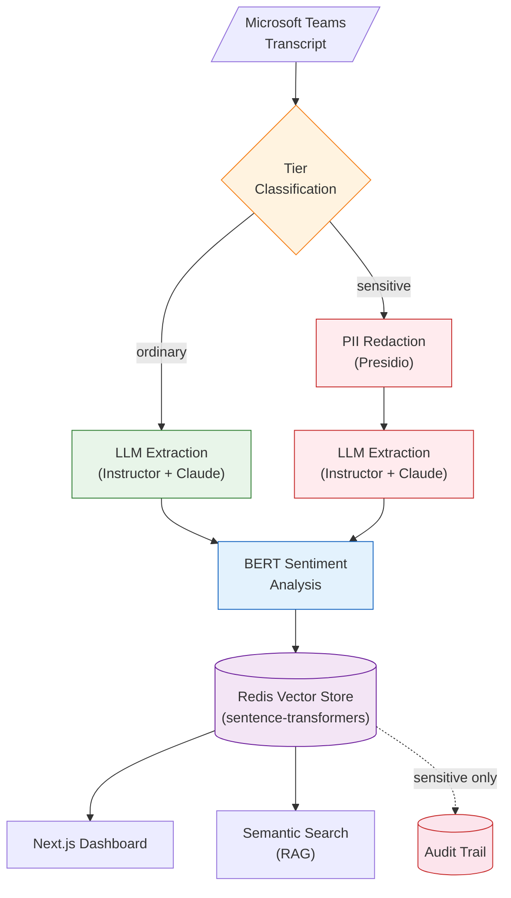
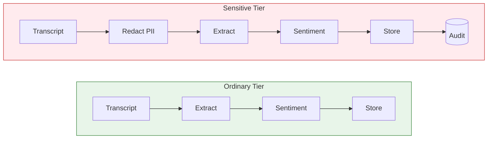
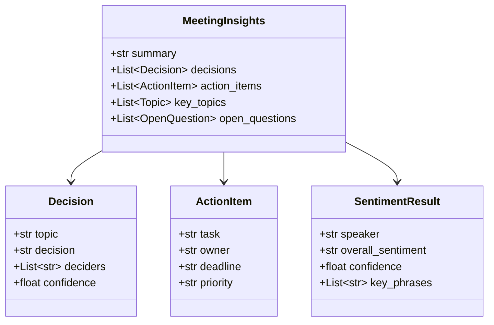
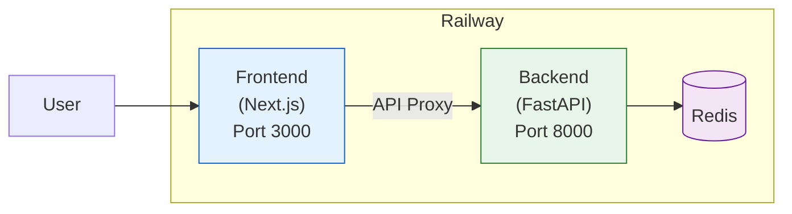

# Meeting Intelligence

Two-tier meeting intelligence pipeline for Microsoft Teams transcripts. Extracts structured insights, performs per-speaker sentiment analysis, and enables semantic search — with automatic PII redaction for sensitive content.

**Live Demo:** [Frontend](https://meeting-intelligence-production.up.railway.app/) | [API Docs](https://meeting-intelligence-api-production.up.railway.app/docs)

## Architecture



> Full architecture documentation with D2 diagrams available in [`docs/architecture/`](docs/architecture/architecture.md).

### System Diagrams (D2)

<p align="center">
  
</p>

<p align="center">
  
</p>

## Privacy Tiers

The system implements a binary privacy model where the tier determines the processing path:



| Feature | Ordinary | Sensitive |
|---------|----------|-----------|
| PII Redaction | No | Yes (Presidio) |
| Access Control | Open | RBAC (restricted) |
| Audit Trail | Basic | Full |
| Redis Namespace | `ordinary:*` | `sensitive:*` |
| Search Scope | Cross-meeting | Tier-isolated |

See [ADR-001](docs/decisions/adr-001-two-tier-model.md) for design rationale.

## Extracted Insights

Each meeting produces a structured `MeetingInsights` object:



## Stack

| Layer | Technology | Purpose |
|-------|-----------|---------|
| LLM Extraction | Claude Sonnet 4 + Instructor | Structured insight extraction with Pydantic validation |
| Sentiment | BERT (multilingual) | Per-speaker sentiment scoring (1-5 stars mapped to pos/neu/neg) |
| PII Redaction | Microsoft Presidio | Entity detection and anonymization for sensitive tier |
| Embeddings | Sentence Transformers (all-MiniLM-L6-v2) | Local 384-dim embeddings, no external API |
| Vector Store | Redis | Embedding storage + cosine similarity search |
| API | FastAPI + Uvicorn | REST API with OpenAPI docs |
| Frontend | Next.js 15 + shadcn/ui | Dashboard, search, and meeting detail views |
| Deploy | Railway (3 services) | Backend + Frontend + Redis |

## Project Structure

```
meeting-intelligence/
├── src/
│   ├── backend/
│   │   ├── api.py              # FastAPI routes (7 endpoints)
│   │   ├── models.py           # Pydantic schemas (12 models)
│   │   ├── pipeline.py         # Pipeline orchestrator
│   │   ├── extractor.py        # Claude + Instructor extraction
│   │   ├── sentiment.py        # BERT sentiment analysis
│   │   ├── vectorstore.py      # Redis embeddings + search
│   │   └── redaction.py        # Presidio PII redaction
│   └── frontend/
│       ├── app/                # Next.js App Router
│       │   ├── dashboard/      # Analytics dashboard
│       │   ├── meetings/       # Meeting list + detail
│       │   └── search/         # Semantic search
│       └── components/         # shadcn/ui components
├── docs/
│   ├── architecture/           # Architecture docs + D2 diagrams
│   ├── diagrams/               # D2 source + rendered SVG/PNG
│   ├── decisions/              # Architecture Decision Records
│   ├── features/               # Feature documentation
│   ├── api/                    # API endpoint reference
│   └── deployment/             # Railway setup guide
├── examples/                   # Demo and seed scripts
├── Dockerfile                  # Backend container (Python 3.11)
└── pyproject.toml              # Python dependencies
```

## API Endpoints

| Method | Endpoint | Description |
|--------|----------|-------------|
| `GET` | `/health` | Health check (Redis status, version) |
| `POST` | `/api/v1/meetings/process` | Submit transcript for pipeline processing |
| `GET` | `/api/v1/meetings/search?q=...` | Semantic search across meetings |
| `GET` | `/api/v1/meetings?tier=ordinary` | List meetings by tier |
| `GET` | `/api/v1/meetings/{id}` | Get meeting with full insights |
| `GET` | `/api/v1/meetings/{id}/transcript` | Get raw transcript text |
| `DELETE` | `/api/v1/meetings/{id}` | Delete meeting data |

Interactive docs: `/docs` (Swagger UI) and `/redoc` (ReDoc).

## Quick Start

### Backend

```bash
# Install dependencies
pip install -e ".[dev]"

# Download spaCy model (required by Presidio)
python -m spacy download en_core_web_lg

# Configure environment
cp .env.example .env
# Edit .env with your ANTHROPIC_API_KEY and REDIS_URL

# Start server
uvicorn backend.api:app --reload
```

### Frontend

```bash
cd src/frontend
npm install
npm run dev
```

### Environment Variables

```bash
# Required
ANTHROPIC_API_KEY=sk-ant-...    # Claude API key
REDIS_URL=redis://localhost:6379 # Redis connection

# Optional
LOG_LEVEL=INFO
CORS_ORIGINS=http://localhost:3000
```

## Deployment



Three Railway services:
- **Backend** — FastAPI on port 8000 (Docker, Python 3.11-slim) — [API Docs](https://meeting-intelligence-api-production.up.railway.app/docs)
- **Frontend** — Next.js on port 3000 (API proxy at `/api/[...path]`) — [Live](https://meeting-intelligence-production.up.railway.app/)
- **Redis** — Railway native plugin (persistent)

See [Railway Setup Guide](docs/deployment/railway-setup.md) for detailed configuration.

## Documentation

| Document | Description |
|----------|-------------|
| [Architecture](docs/architecture/architecture.md) | System design, data flow, and component details |
| [ADR-001: Two-Tier Model](docs/decisions/adr-001-two-tier-model.md) | Privacy architecture decision record |
| [Privacy Tiers](docs/features/privacy-tiers.md) | Tier behavior and PII entity types |
| [Structured Extraction](docs/features/structured-extraction.md) | LLM extraction with Instructor |
| [Sentiment Analysis](docs/features/sentiment-analysis.md) | BERT-based per-speaker analysis |
| [Semantic Search](docs/features/semantic-search.md) | RAG implementation and vector search |
| [API Reference](docs/api/endpoints.md) | REST endpoint documentation |
| [Deployment](docs/deployment/railway-setup.md) | Railway deployment guide |
