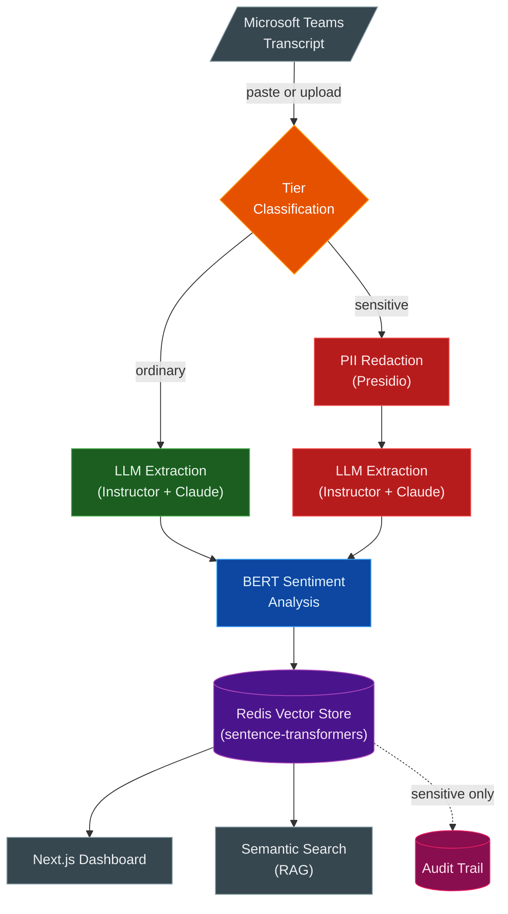

# Meeting Intelligence

Two-tier meeting intelligence pipeline for Microsoft Teams transcripts. Extracts structured insights, performs per-speaker sentiment analysis, and enables semantic search — with automatic PII redaction for sensitive content.

**Live:** [Frontend](https://meeting-intelligence-production.up.railway.app/) | [API Docs](https://meeting-intelligence-api-production.up.railway.app/docs)

## Architecture



> Detailed architecture, D2 diagrams, sequence diagrams, and data models in [`docs/architecture/`](docs/architecture/architecture.md).

## Stack

| Layer | Technology |
|-------|-----------|
| LLM Extraction | Claude Haiku 4 + Instructor + Pydantic 2 |
| Sentiment | BERT multilingual (per-speaker) |
| PII Redaction | Microsoft Presidio |
| Embeddings | Sentence Transformers (all-MiniLM-L6-v2, local) |
| Vector Store | Redis (cosine similarity) |
| API | FastAPI |
| Frontend | Next.js 15 + shadcn/ui |
| Deploy | Railway (3 services) |

## Privacy Tiers

| Feature | Ordinary | Sensitive |
|---------|----------|-----------|
| PII Redaction | No | Yes (Presidio) |
| Access | Open | RBAC |
| Audit | Basic | Full |
| Redis Namespace | `ordinary:*` | `sensitive:*` |

## Quick Start

```bash
# Backend
pip install -e ".[dev]"
python -m spacy download en_core_web_lg
cp .env.example .env   # set ANTHROPIC_API_KEY and REDIS_URL
uvicorn backend.api:app --reload

# Frontend
cd src/frontend && npm install && npm run dev
```

## API

| Method | Endpoint | Description |
|--------|----------|-------------|
| `POST` | `/api/v1/meetings/process` | Process transcript (JSON) |
| `POST` | `/api/v1/meetings/upload` | Upload file (.vtt, .docx, .doc, .pdf, .md) |
| `GET` | `/api/v1/meetings/search?q=...` | Semantic search |
| `GET` | `/api/v1/meetings` | List meetings |
| `GET` | `/api/v1/meetings/{id}` | Get meeting insights |
| `DELETE` | `/api/v1/meetings/{id}` | Delete meeting |

Full reference: [`docs/api/endpoints.md`](docs/api/endpoints.md) | Interactive: [`/docs`](https://meeting-intelligence-api-production.up.railway.app/docs)

## Deployment

Three Railway services:
- **Backend** — FastAPI (Docker, Python 3.11) — [API Docs](https://meeting-intelligence-api-production.up.railway.app/docs)
- **Frontend** — Next.js 15 — [Live](https://meeting-intelligence-production.up.railway.app/)
- **Redis** — Railway native plugin

Guide: [`docs/deployment/railway-setup.md`](docs/deployment/railway-setup.md)

## Docs

| | |
|---|---|
| [Architecture](docs/architecture/architecture.md) | System design, diagrams, data models |
| [ADR-001: Two-Tier Model](docs/decisions/adr-001-two-tier-model.md) | Privacy architecture decision |
| [Privacy Tiers](docs/features/privacy-tiers.md) | Tier behavior and PII entities |
| [Structured Extraction](docs/features/structured-extraction.md) | LLM extraction with Instructor |
| [Sentiment Analysis](docs/features/sentiment-analysis.md) | BERT per-speaker analysis |
| [Semantic Search](docs/features/semantic-search.md) | RAG and vector search |
