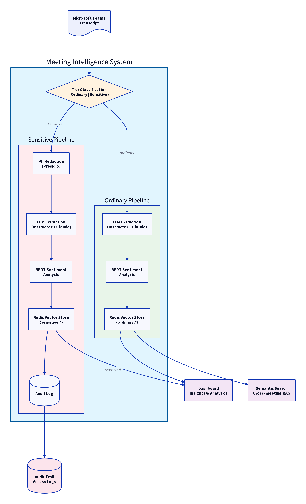
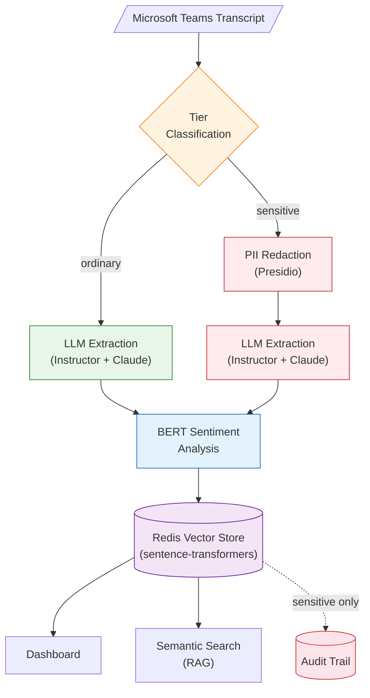
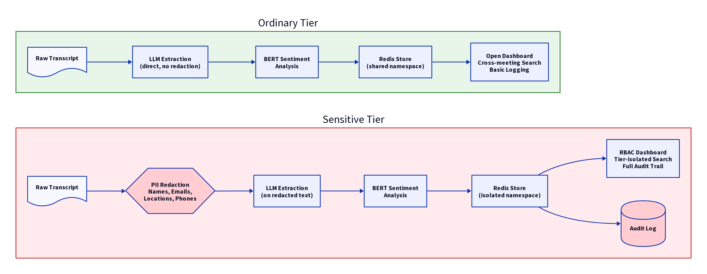
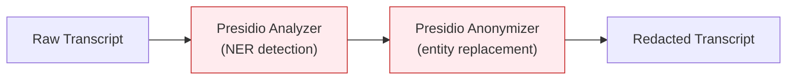
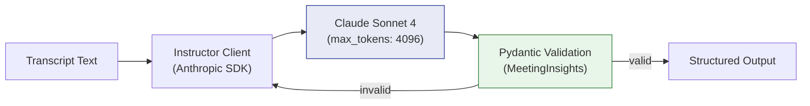
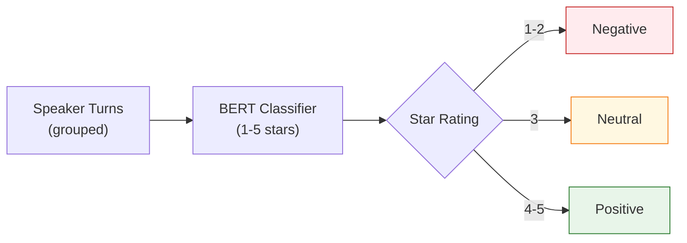
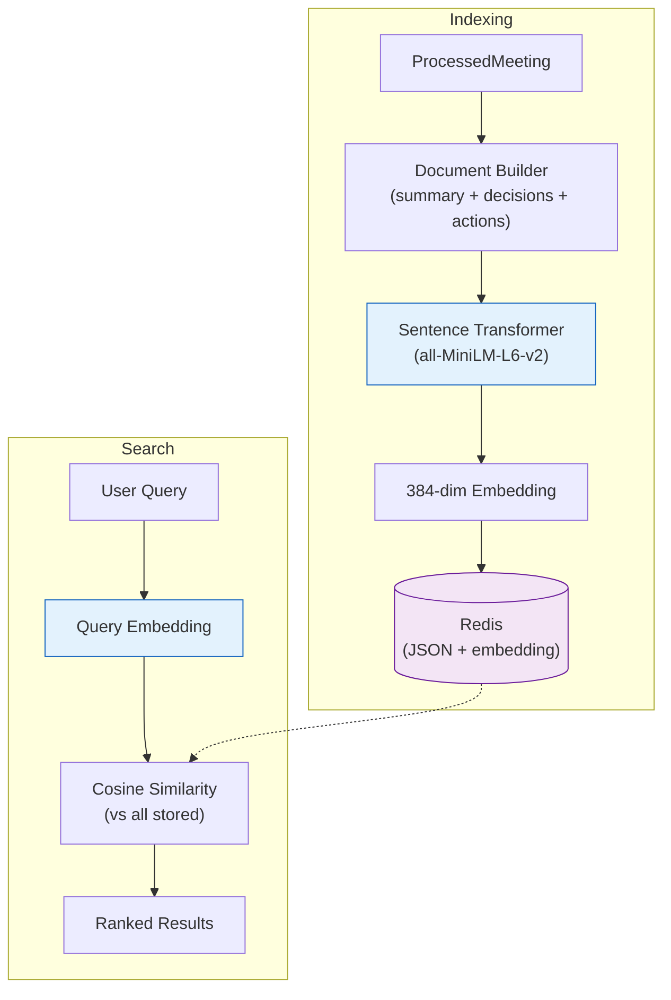
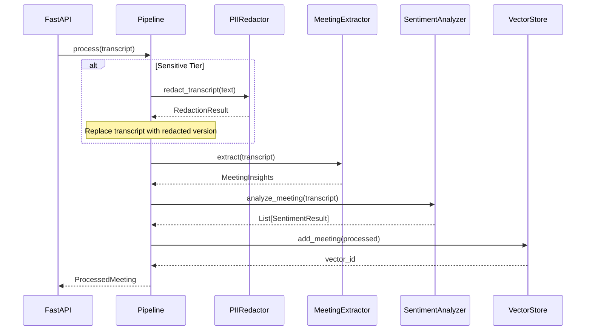
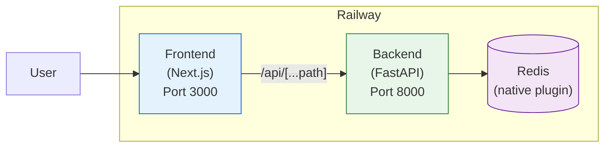
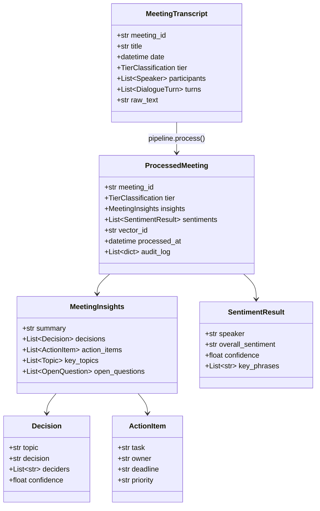

# Architecture

## System Overview

Meeting Intelligence is a two-tier pipeline that processes Microsoft Teams transcripts into structured, searchable insights. The system is designed around a **privacy-first** architecture where data sensitivity determines the processing path.



## High-Level Flow



## Components

### 1. Tier Classification

Transcripts are classified at ingestion time into one of two privacy tiers:

| Aspect | Ordinary | Sensitive |
|--------|----------|-----------|
| Use case | Team standups, regular meetings | Executive reviews, HR, M&A |
| PII redaction | None | Automatic (Presidio) |
| Access control | Open | RBAC (restricted) |
| Redis namespace | `ordinary:*` | `sensitive:*` |
| Audit trail | Basic | Full |
| Search scope | Cross-meeting | Tier-isolated |

```python
class TierClassification(str, Enum):
    ORDINARY = "ordinary"
    SENSITIVE = "sensitive"
```



### 2. PII Redaction (Sensitive Tier Only)

For sensitive meetings, PII is redacted **before** any LLM processing to prevent data leakage to external providers.



**Redacted entity types:**

| Entity | Example | Replacement |
|--------|---------|-------------|
| `PERSON` | John Smith | `<PERSON>` |
| `EMAIL_ADDRESS` | john@acme.com | `<EMAIL_ADDRESS>` |
| `PHONE_NUMBER` | +1-555-0123 | `<PHONE_NUMBER>` |
| `LOCATION` | Oslo, Norway | `<LOCATION>` |
| `CREDIT_CARD` | 4111-1111-... | `<CREDIT_CARD>` |
| `DATE_TIME` | January 15, 2025 | `<DATE_TIME>` |
| `NRP` | Nationality/Religious/Political | `<NRP>` |

**Implementation:** `src/backend/redaction.py` — `PIIRedactor` class using Microsoft Presidio.

### 3. Structured Extraction (LLM)

Uses **Claude Sonnet 4** via the **Instructor** library to extract structured data from transcripts. Instructor enforces Pydantic schema validation with automatic retries.



**Extracted schema (`MeetingInsights`):**

```
MeetingInsights
├── summary: str                    # Brief meeting overview
├── decisions: List[Decision]       # topic, decision, deciders, confidence
├── action_items: List[ActionItem]  # task, owner, deadline, priority
├── key_topics: List[Topic]         # name, importance, related_speakers
└── open_questions: List[OpenQuestion]  # question, context, stakeholders
```

**Implementation:** `src/backend/extractor.py` — `MeetingExtractor` class.

### 4. Sentiment Analysis

Per-speaker sentiment scoring using a multilingual BERT model (`nlptown/bert-base-multilingual-uncased-sentiment`). The model outputs 1-5 star ratings mapped to sentiment labels.



**Output (`SentimentResult`):**
- `speaker` — participant name
- `overall_sentiment` — positive / neutral / negative
- `confidence` — model confidence (0.0 to 1.0)
- `key_phrases` — representative phrases from the speaker

**Implementation:** `src/backend/sentiment.py` — `SentimentAnalyzer` class.

### 5. Vector Store & Semantic Search

Embeddings are generated locally using **Sentence Transformers** (`all-MiniLM-L6-v2`, 384 dimensions) and stored in **Redis**. Search uses cosine similarity computed in-process (no Redis Stack required).



**Redis key structure:**

| Key Pattern | Content |
|-------------|---------|
| `meeting:{namespace}:{id}` | Full processed meeting (JSON) |
| `emb:{namespace}:{id}` | 384-dim embedding vector (JSON) |
| `idx:{namespace}` | Set of all meeting IDs in namespace |
| `transcript:{namespace}:{id}` | Raw transcript text |

**Implementation:** `src/backend/vectorstore.py` — `MeetingVectorStore` class.

## Pipeline Orchestration

The `MeetingPipeline` class (`src/backend/pipeline.py`) coordinates all components:



Each step appends to the `audit_log` with timestamps, enabling full traceability.

## API Layer

FastAPI REST API with 7 endpoints:

| Method | Endpoint | Purpose |
|--------|----------|---------|
| `GET` | `/health` | Health check (redis status, version) |
| `POST` | `/api/v1/meetings/process` | Submit transcript for processing |
| `GET` | `/api/v1/meetings/search` | Semantic search across meetings |
| `GET` | `/api/v1/meetings` | List meetings by tier |
| `GET` | `/api/v1/meetings/{id}` | Get meeting insights |
| `GET` | `/api/v1/meetings/{id}/transcript` | Get raw transcript |
| `DELETE` | `/api/v1/meetings/{id}` | Delete meeting data |

Interactive docs available at [`/docs`](https://meeting-intelligence-api-production.up.railway.app/docs) (Swagger) and [`/redoc`](https://meeting-intelligence-api-production.up.railway.app/redoc) (ReDoc).

## Frontend

Next.js 15 dashboard with App Router, shadcn/ui components, and dark/light theme support.

| Route | Purpose |
|-------|---------|
| `/` | Upload transcript for processing |
| `/dashboard` | Analytics and insights overview |
| `/meetings` | Meeting list with tier filtering |
| `/meetings/[id]` | Full meeting detail view |
| `/search` | Semantic search interface |

## Deployment Architecture



Three Railway services:
- **Backend** — Python 3.11 Docker container (FastAPI + Uvicorn)
- **Frontend** — Next.js 15 with API proxy route (`/api/[...path]`)
- **Redis** — Railway native plugin (persistent)

## Data Models



## Design Decisions

See [ADR-001: Two-Tier Privacy Model](../decisions/adr-001-two-tier-model.md) for the rationale behind the binary tier classification.

Key trade-offs:
- **Pre-processing redaction** (not post-processing) — prevents PII from reaching the LLM provider
- **Local embeddings** (sentence-transformers) — no external API dependency for vectorization
- **In-process cosine similarity** — works with standard Redis (no Redis Stack required)
- **Binary tier model** — simplicity over granularity for initial implementation
